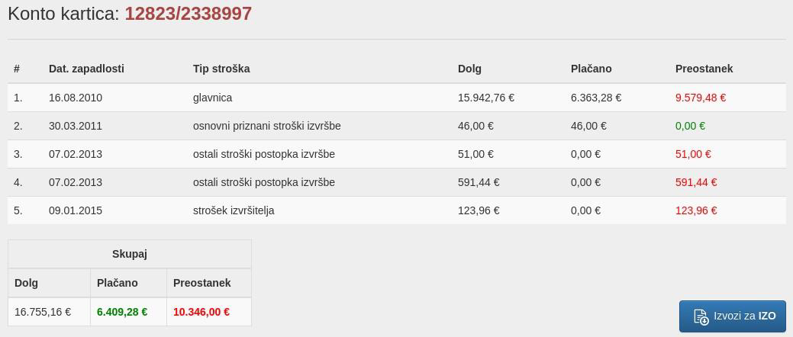

# Calculation-of-default-interest

#### Required skills to finish the assignment

* CodeIgniter 3 (3.1.11)
* PHPUnit 7.X
* Bootstrap 3.X
* GIT
* WAMP, MAMP, XAMP, Vagrant, Valet, Docker ....

#### Assignment

All tasks are linked to each other and escalate in difficulty. It is necessary to solve the tasks in the order indicated, since without one completed task you cannot proceed to another (in most cases). An asterisk (*) indicates additional tasks that are not required to continue but are recommended.

If the instructions of the assignment are not clear, please ask for a more detailed explanation of the assignment.
___
#### Preparing the environment
The folder has everything you need for initial development. It is up to you to choose the development environment (IDE) for you, choose the program that is most comfortable for you. We recommend [PhpStorm](https://www.jetbrains.com/phpstorm/).

##### Database
The folder has the database db_dump.sql, which you will need to import into the MySQL database in a previously created zap_IZO schema.

A username and the password:

> U: IZOBaza2017  
> P: IZOBaza2017*A

You can import the database via a terminal or graphic data as desired.

##### CodeIgniter
Today, you will use the [Codeigniter (CI)](https://codeigniter.com/) PHP framework to connect to the previously imported database and develop the application. Connect the CI to the database via the PDO with the information given in the previous exercise. The framework itself is already ready with the `home.php` view, which you will upgrade in the following tutorials.
The home view contains HTML code without the main content. Design is solved with the Bootstrap CSS framework.
After you have successfully connected to the base, continue to the next exercise.
___
#### Debtor account card
If you looked at the data and tables you imported, you could see that it was the data of the debtor and his account cards. In this task you will output the account card information to the table.

The account card consists of:
Identification Numbers 
* Decision / debtor ID
* List of expenses / debts and payments
* The total sum of current debt
Your account card should be as similar as possible to the illustration above - the table is drawn with Bootstrap and responsive.
###### The illustration has a button for exporting data - the button has a fontawesome icon (the icon does not exist in the frame itself)
___
#### Default interest calculation - IZO application
However, for every account in the judicial sector, a complex calculation of interest by period is required for completeness. Since implementation of such a calculation is demanding, we will use the [IZO web application](http://izo.sodisce.si/izo-web/spring/izracun?execution=e2s1) on the websites of the Supreme Court of Slovenia. The app allows you to import and export calculation data.
The data from your account card must be exported to a file suitable for import to the IZO.
In this task, you need to check the file type and format required for import. Imports should be properly tested. Interest is always counted on today.

> The file should be automatically downloaded to your computer. The file name should be the code (identification number) of the account card and a suitable extension.
